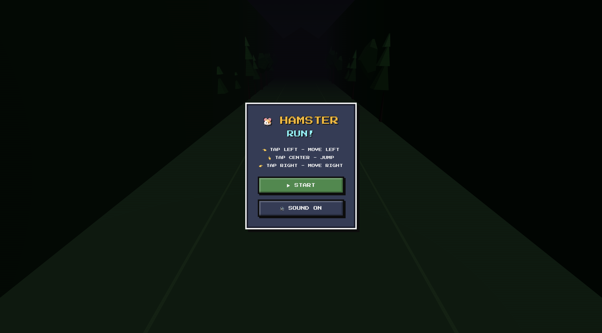
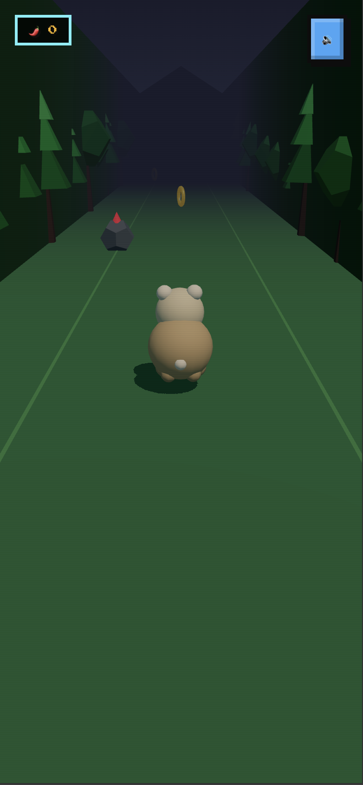
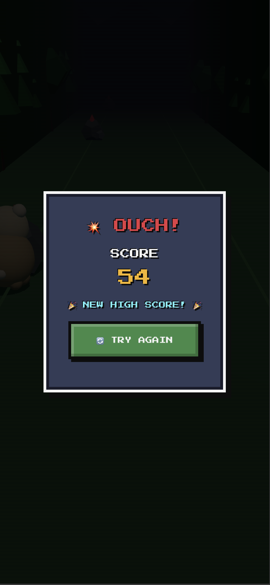

# Hamster Run — Scrolly Jam Submission

[](https://docs.pmnd.rs/react-three-fiber) [](https://nextjs.org/) [](https://www.typescriptlang.org/)

A fast-paced 3D endless runner where you guide a hamster through an obstacle course, collecting coins, power-ups, and dodging rocks. Built for Scrolly x Superteam UK's Game Jam using AI-assisted development with React Three Fiber.

- **Dynamic difficulty**: Speed increases every 5 seconds
- **Power-ups**: Speed boost (pepper), coin magnet, golden coins
- **Speed-based camera FOV**: Field of view widens as you accelerate
- **Retro 8-bit audio**: CC0 sound effects from OpenGameArt
- **Procedural chiptune BGM**: 140 BPM retro soundtrack
- **Mobile-friendly**: Touch controls with lane switching

## Screenshots

<p align="center">
  
</p>

<p align="center">
  
  
</p>

## Video Demo

[Watch gameplay video](game-demo-mobile.mov)

## Features

### Gameplay Mechanics
- **Three-lane system**: Swipe/tap to switch lanes or jump
- **Collectibles**:
  - 🪙 **Coins** (30% spawn): +5 points, golden torus pickups
  - 🌶️ **Pepper boost** (15% spawn): 5-second speed multiplier with visible jet effect
  - 🧲 **Magnet** (5% spawn): 8-second auto-collect for coins across all lanes
  - 🪨 **Rocks** (50% spawn): Obstacles to avoid or jump over
- **Time-based progression**: Speed increases every 5 seconds up to max
- **Combo system**: Chain collectibles for higher scores
- **Lives & highscore**: Track best performance with localStorage

### Technical Highlights
- **React Three Fiber**: 3D scene with custom shaders and geometries
- **Dynamic camera**: FOV adjusts from 60° to 80° based on speed
- **Procedural audio**: Web Audio API synthesis with retro 8-bit samples
- **Client-side rendering**: Hydration-safe Next.js implementation
- **Zustand state**: Clean global game state management

## Running Locally

```bash
cd scrolly-gamejam
npm install
npm run dev
# Open http://localhost:3000
```

## Controls

### Desktop
- **Left/Right Arrow**: Switch lanes
- **Up Arrow / Space**: Jump
- **M**: Toggle mute

### Mobile
- **Tap left/right side**: Switch lanes
- **Tap top half**: Jump
- **Mute button**: Toggle audio

## Game Structure

```
src/components/game/
├── Game.tsx           # Main game component with UI overlays
├── GameManager.ts     # Zustand store for state management
├── Player.tsx         # Hamster 3D model with boost visual
├── Obstacles.tsx      # Spawning system for coins/rocks/power-ups
├── World.tsx          # Ground plane and environment
└── AudioManager.tsx   # Sound effects and BGM controller
```

## Power-Up Details

### Speed Boost (Pepper)
- Duration: 5 seconds
- Effect: 1.8x speed multiplier
- Visual: Glowing cyan jet behind hamster
- Points: +2

### Magnet
- Duration: 8 seconds
- Effect: Auto-collect coins across all lanes
- Visual: Cyan horseshoe icon
- Points: +3

### Coin
- Effect: Instant score boost
- Visual: Golden spinning torus
- Points: +5

## Audio Credits

- **8-bit SFX**: [SubspaceAudio's 512 Sound Effects Pack](https://opengameart.org/content/512-sound-effects-8-bit-style) (CC0)
- **BGM**: Procedurally generated 140 BPM chiptune with kick/hi-hat/bassline

## Theme

Built as an endless runner arcade experience with:
- Hamster protagonist for wholesome vibes
- Retro 8-bit aesthetic (sound + visual)
- Progressive difficulty for replayability
- Mobile-first design for feed shareability

## Notes

- Optimized for portrait/landscape on mobile and desktop
- No external dependencies for audio (fallback to procedural synthesis)
- Score persists via localStorage for high score tracking
- Screen shake and haptic feedback on iOS devices

## License

Unlicensed; for hackathon submission only.
